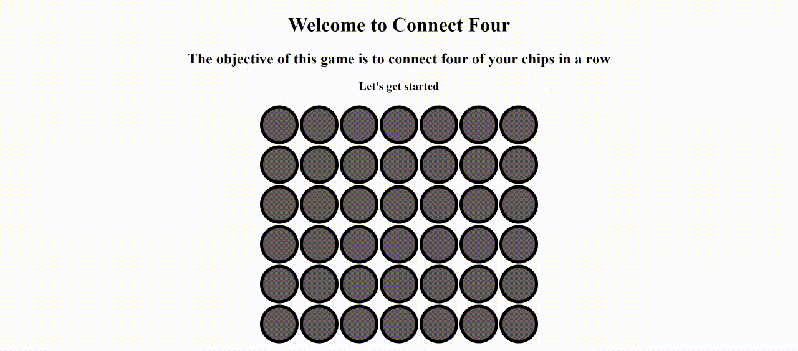

# connect-four
Connect Four (also known as Connect 4, Four Up, Plot Four, Find Four, Captain's Mistress, Four in a Row, Drop Four, and Gravitrips in the Soviet Union) is a two-player connection board game, in which the players choose a color and then take turns dropping colored tokens into a seven-column, six-row vertically suspended grid. The pieces fall straight down, occupying the lowest available space within the column. The objective of the game is to be the first to form a horizontal, vertical, or diagonal line of four of one's own tokens. Connect Four is a solved game. The first player can always win by playing the right moves.

For more details you can refer to [wikipedia](https://en.wikipedia.org/wiki/Connect_Four)

## Demo

